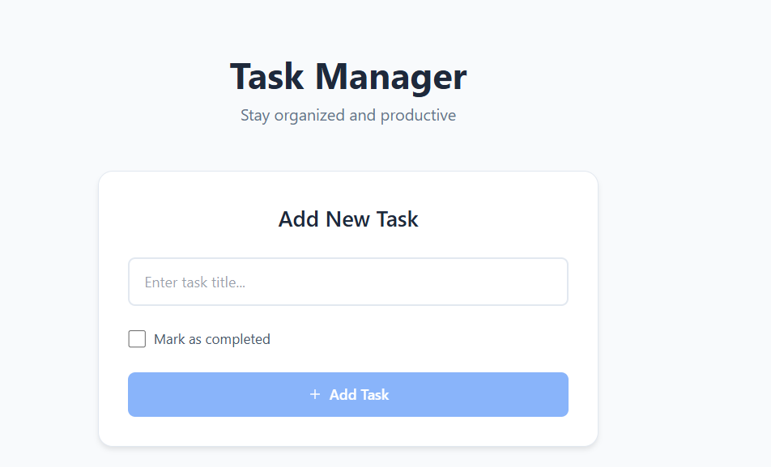
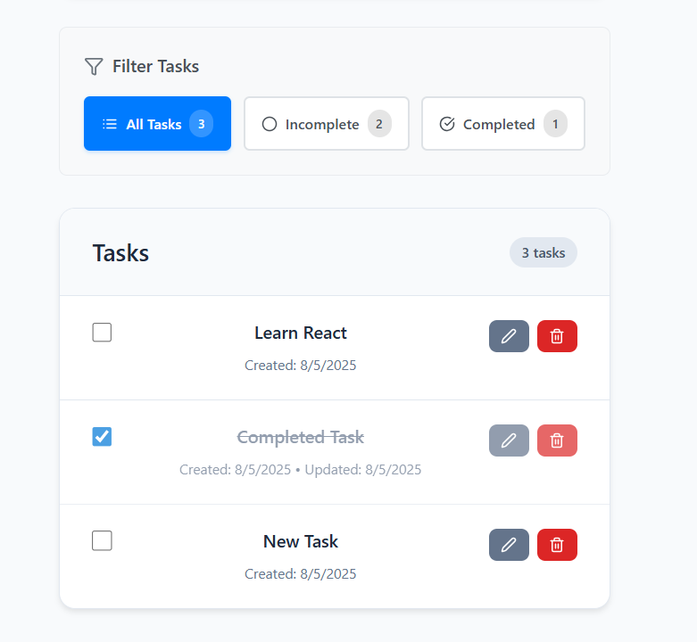

# Task Manager

A full-stack Task Manager application with a [React](https://reactjs.org/) client built using [Vite](https://vitejs.dev/) and a [Node.js Express](https://expressjs.com/) server.


Sample Screenshots





## Table of Contents
- [Features](#features)
- [Architecture](#architecture)
- [Getting Started](#getting-started)
  - [Client](#client)
- [API Endpoints](#api-endpoints)
- [Project Structure](#project-structure)
- [License](#license)

## Features

- Create, update, delete, and list tasks
- RESTful API with Express for task management ([`server/index.js`](d:/Workspace/gta%20tech/task-manager/server/index.js))
- React client with real-time updates and a modern UI ([`client/src/main.tsx`](d:/Workspace/gta%20tech/task-manager/client/src/main.tsx))
- Tailwind CSS for styling
- ESLint configured for code quality and consistency

## Architecture

- **Server:** An Express API that handles CRUD operations for tasks. Controller logic is implemented in [`server/controllers/manager.controller.js`](d:/Workspace/gta%20tech/task-manager/server/controllers/manager.controller.js) and routes are defined in [`server/routes/manage.route.js`](d:/Workspace/gta%20tech/task-manager/server/routes/manage.route.js).
- **Client:** A React application built with TypeScript and Vite. It communicates with the server via an Axios-based API client ([`client/src/api/api.ts`](d:/Workspace/gta%20tech/task-manager/client/src/api/api.ts)).

## Getting Started

### Server

1. **Navigate to the server directory:**
    ```sh
    cd server
    ```
2. **Install dependencies:**
    ```sh
    npm install
    ```
3. **Start the development server:**
    ```sh
    npm run dev
    ```
   The server will run on [http://localhost:5000](http://localhost:5000).

### Client

1. **Navigate to the client directory:**
    ```sh
    cd client
    ```
2. **Install dependencies:**
    ```sh
    npm install
    ```
3. **Start the development server:**
    ```sh
    npm run dev
    ```
   The client will run on [http://localhost:5173](http://localhost:5173) by default.

## API Endpoints

The Express server provides these endpoints:

- `GET /tasks` — Retrieve all tasks.
- `POST /tasks` — Create a new task (requires a non-empty ).
- `PUT /tasks/:id` — Update an existing task.
- `DELETE /tasks/:id` — Delete a task.
- `GET /tasks/:id` — Retrieve a task by its ID.
- `GET /health` — Health check endpoint.

For more details, refer to `server/routes/manage.route.js`.

## Project Structure
├── client │ ├── public │ ├── src │ │ ├── api │ │ ├── assets │ │ ├── components │ │ ├── pages │ │ ├── types │ │ └── ... │ ├── package.json │ └── vite.config.ts

├── server │ ├── controllers │ ├── data │ ├── routes │ ├── index.js │ └── package.json └── .gitattributes


## License

This project is licensed under the MIT License.

